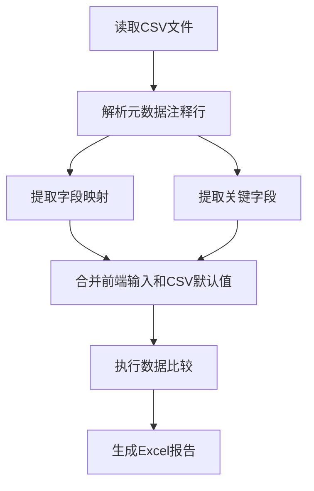

# CSV元数据功能说明

## 功能概述

CSV元数据功能允许你在CSV文件中嵌入字段映射和关键字段信息，实现智能的元数据管理。系统会优先使用前端输入的值，如果没有输入则自动使用CSV文件中的默认值。

## 🎯 核心特性

### 1. 智能元数据合并
- **前端优先**: 前端输入的值会覆盖CSV中的默认值
- **自动回退**: 如果前端没有输入，自动使用CSV中的默认值
- **灵活配置**: 支持部分字段使用前端值，部分使用CSV默认值

### 2. CSV元数据格式
- 在CSV文件头部添加元数据注释行
- 使用标准JSON格式存储映射关系
- 支持字段映射和关键字段配置

### 3. 向后兼容
- 支持传统的CSV文件（无元数据）
- 支持带元数据的新格式CSV文件
- 自动检测和解析元数据

## 📁 CSV文件格式

### 元数据注释行格式

```csv
# FIELD_MAPPING: {"source_field": "target_field", "id": "user_id"}
# KEY_FIELDS: ["id"]
# METADATA_END
field1,field2,field3
value1,value2,value3
```

### 示例文件

#### 源CSV文件 (sample_source_with_mapping.csv)
```csv
# FIELD_MAPPING: {"id": "user_id", "name": "full_name", "age": "user_age", "city": "location", "salary": "annual_income"}
# KEY_FIELDS: ["id"]
# METADATA_END
id,name,age,city,salary
1,Alice,30,New York,50000
2,Bob,25,Los Angeles,45000
3,Charlie,35,Chicago,60000
4,Diana,28,Boston,52000
5,Edward,32,Seattle,58000
```

#### 目标CSV文件 (sample_target_with_mapping.csv)
```csv
# FIELD_MAPPING: {"id": "user_id", "name": "full_name", "age": "user_age", "city": "location", "salary": "annual_income"}
# KEY_FIELDS: ["id"]
# METADATA_END
user_id,full_name,user_age,location,annual_income
1,Alice,30,New York,51000
2,Bob,25,Los Angeles,45000
3,Charlie,35,Chicago,60000
4,Diana,28,Boston,52000
6,Frank,29,Denver,55000
```

## 🔄 元数据合并逻辑

### 字段映射合并规则

```python
def merge_field_mapping(frontend_mapping, csv_default_mapping):
    """
    合并字段映射
    
    规则:
    1. 如果前端有输入，使用前端值
    2. 如果前端没有输入，使用CSV默认值
    3. 支持部分字段使用前端，部分使用CSV默认值
    """
    result = csv_default_mapping.copy()  # 先复制CSV默认值
    if frontend_mapping:  # 如果前端有输入
        result.update(frontend_mapping)  # 用前端值覆盖
    return result
```

### 关键字段合并规则

```python
def merge_key_fields(frontend_fields, csv_default_fields):
    """
    合并关键字段
    
    规则:
    1. 如果前端有输入，使用前端值
    2. 如果前端没有输入，使用CSV默认值
    """
    if frontend_fields:  # 前端优先
        return frontend_fields
    else:
        return csv_default_fields if csv_default_fields else []
```

## 🚀 使用方法

### 1. 创建带元数据的CSV文件

```python
# 在CSV文件开头添加元数据
metadata_lines = [
    '# FIELD_MAPPING: {"id": "user_id", "name": "full_name"}',
    '# KEY_FIELDS: ["id"]',
    '# METADATA_END'
]

# 然后是数据行
data_lines = [
    'id,name,age,city',
    '1,Alice,30,New York',
    '2,Bob,25,Los Angeles'
]

# 合并并保存
with open('data_with_metadata.csv', 'w') as f:
    f.write('\n'.join(metadata_lines + [''] + data_lines))
```

### 2. API调用示例

#### 使用CSV默认元数据
```python
import requests

files = {
    'source_csv': open('source_with_mapping.csv', 'rb'),
    'target_csv': open('target_with_mapping.csv', 'rb')
}

# 不传入字段映射和关键字段，使用CSV默认值
data = {
    'field_mapping': '{}',
    'key_fields': '[]'
}

response = requests.post(
    'http://localhost:3000/data/compare',
    files=files,
    data=data
)
```

#### 前端输入覆盖CSV默认值
```python
# 前端传入不同的配置
data = {
    'field_mapping': '{"id": "user_id", "name": "full_name"}',
    'key_fields': '["id", "name"]'  # 使用复合主键
}

response = requests.post(
    'http://localhost:3000/data/compare',
    files=files,
    data=data
)
```

#### 混合使用元数据
```python
# 部分字段使用前端值，部分使用CSV默认值
data = {
    'field_mapping': '{"id": "user_id"}',  # 只覆盖id字段
    'key_fields': '[]'  # 使用CSV默认值
}

response = requests.post(
    'http://localhost:3000/data/compare',
    files=files,
    data=data
)
```

## 🧪 测试功能

### 运行测试脚本

```bash
python test_csv_metadata.py
```

### 测试场景

1. **默认元数据测试**: 验证CSV元数据读取功能
2. **前端覆盖测试**: 验证前端输入优先级
3. **混合使用测试**: 验证部分字段覆盖功能

## 📊 元数据解析流程



## 🔧 技术实现

### 元数据解析函数

```python
def read_csv_with_metadata(file):
    """读取CSV文件并提取元数据"""
    metadata = {}
    lines = []
    
    for line in file:
        line_str = line.decode('utf-8').strip()
        if line_str.startswith('# FIELD_MAPPING:'):
            # 解析字段映射
            mapping_str = line_str.replace('# FIELD_MAPPING:', '').strip()
            metadata['field_mapping'] = eval(mapping_str)
        elif line_str.startswith('# KEY_FIELDS:'):
            # 解析关键字段
            fields_str = line_str.replace('# KEY_FIELDS:', '').strip()
            metadata['key_fields'] = eval(fields_str)
        elif line_str == '# METADATA_END':
            # 元数据结束标记
            continue
        elif line_str.startswith('#'):
            # 其他注释行，跳过
            continue
        else:
            # 数据行
            lines.append(line_str)
    
    # 重新设置文件指针并读取数据
    file.seek(0)
    if lines:
        csv_content = '\n'.join(lines)
        df = pd.read_csv(io.StringIO(csv_content))
    else:
        df = pd.DataFrame()
    
    return df, metadata
```

### 元数据合并函数

```python
def merge_metadata(frontend_data, csv_default):
    """合并前端数据和CSV默认值"""
    if isinstance(frontend_data, dict):
        # 字段映射：前端优先，CSV默认值补充
        result = csv_default.copy() if csv_default else {}
        if frontend_data:
            result.update(frontend_data)
        return result
    elif isinstance(frontend_data, list):
        # 关键字段：前端优先，CSV默认值作为备选
        if frontend_data:
            return frontend_data
        else:
            return csv_default if csv_default else []
    else:
        return csv_default if csv_default else ({} if isinstance(frontend_data, dict) else [])
```

## 📝 注意事项

### 1. 元数据格式要求
- 元数据行必须以 `#` 开头
- 字段映射必须是有效的JSON格式
- 关键字段必须是有效的JSON数组格式
- 使用 `# METADATA_END` 标记元数据结束

### 2. 文件编码
- 建议使用UTF-8编码
- 确保元数据行和数据行使用相同的编码

### 3. 向后兼容
- 传统CSV文件（无元数据）仍然可以正常使用
- 系统会自动检测是否有元数据

### 4. 错误处理
- 元数据解析失败时会使用空值
- 不会影响数据比较功能

## 🔮 未来扩展

### 1. 更多元数据类型
- 数据类型定义
- 验证规则配置
- 业务逻辑配置

### 2. 元数据模板
- 预定义的元数据模板
- 行业标准配置
- 快速配置工具

### 3. 元数据验证
- 元数据格式验证
- 字段映射一致性检查
- 自动错误提示

---

**总结**: CSV元数据功能让数据比较更加智能和灵活，既支持传统的配置方式，又提供了CSV内嵌配置的便利性。前端输入始终具有最高优先级，确保用户可以根据需要灵活调整配置。🎯✨
