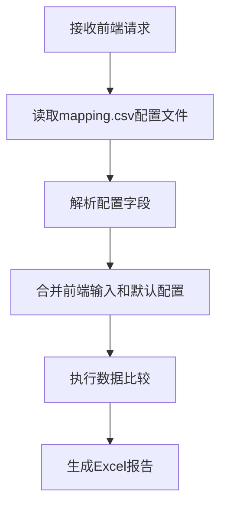

# Mapping.csv 配置文件功能说明

## 功能概述

`mapping.csv` 配置文件功能允许你将字段映射和关键字段配置集中存储在一个独立的CSV文件中，作为系统的默认配置。这样可以让配置管理更加集中、清晰，同时保持前端输入的灵活性。

## 🎯 核心特性

### 1. 集中配置管理
- **统一配置**: 所有默认的字段映射和关键字段配置集中在一个文件中
- **易于维护**: 修改配置只需要编辑一个文件
- **版本控制**: 配置文件可以纳入版本控制系统

### 2. 智能配置合并
- **前端优先**: 前端输入的值会覆盖配置文件中的默认值
- **自动回退**: 如果前端没有输入，自动使用配置文件中的默认值
- **灵活配置**: 支持部分字段使用前端值，部分使用默认配置

### 3. 向后兼容
- 支持传统的配置方式（前端传入完整配置）
- 支持纯默认配置（前端不传入任何配置）
- 支持混合配置（部分使用前端，部分使用默认）

## 📁 配置文件格式

### mapping.csv 文件结构

```csv
# CSV字段映射配置文件
# 此文件包含默认的字段映射关系和关键字段配置
# 格式说明：
# - FIELD_MAPPING: 源字段到目标字段的映射关系
# - KEY_FIELDS: 用于关联记录的关键字段列表
# - DESCRIPTION: 配置说明

FIELD_MAPPING,{"id": "user_id", "name": "full_name", "age": "user_age", "city": "location", "salary": "annual_income"}
KEY_FIELDS,["id"]
DESCRIPTION,用户数据字段映射配置
SOURCE_TABLE,users_source
TARGET_TABLE,users_target
CREATED_DATE,2025-09-02
VERSION,1.0
```

### 配置字段说明

| 字段名 | 类型 | 必需 | 说明 |
|--------|------|------|------|
| `FIELD_MAPPING` | JSON对象 | 是 | 源字段到目标字段的映射关系 |
| `KEY_FIELDS` | JSON数组 | 是 | 用于关联记录的关键字段列表 |
| `DESCRIPTION` | 字符串 | 否 | 配置说明和用途描述 |
| `SOURCE_TABLE` | 字符串 | 否 | 源表名称标识 |
| `TARGET_TABLE` | 字符串 | 否 | 目标表名称标识 |
| `CREATED_DATE` | 日期 | 否 | 配置创建日期 |
| `VERSION` | 字符串 | 否 | 配置版本号 |

## 🔄 配置合并逻辑

### 字段映射合并规则

```python
def merge_field_mapping(frontend_mapping, default_mapping):
    """
    合并前端字段映射和默认字段映射
    
    规则:
    1. 如果前端有输入，使用前端值
    2. 如果前端没有输入，使用默认配置
    3. 支持部分字段使用前端，部分使用默认配置
    """
    if not default_mapping:
        return frontend_mapping
    
    if not frontend_mapping:
        return default_mapping
    
    # 前端优先，默认值补充
    result = default_mapping.copy()
    result.update(frontend_mapping)
    return result
```

### 关键字段合并规则

```python
def merge_key_fields(frontend_fields, default_fields):
    """
    合并前端关键字段和默认关键字段
    
    规则:
    1. 前端输入优先
    2. 如果前端没有输入，使用默认配置
    """
    if frontend_fields:
        return frontend_fields
    else:
        return default_fields if default_fields else []
```

## 🚀 使用方法

### 1. 创建配置文件

```python
# 创建mapping.csv配置文件
config_content = """# CSV字段映射配置文件
FIELD_MAPPING,{"id": "user_id", "name": "full_name", "age": "user_age"}
KEY_FIELDS,["id"]
DESCRIPTION,用户数据字段映射配置
VERSION,1.0
"""

with open('mapping.csv', 'w', encoding='utf-8') as f:
    f.write(config_content)
```

### 2. API调用示例

#### 使用默认配置
```python
import requests

files = {
    'source_csv': open('source.csv', 'rb'),
    'target_csv': open('target.csv', 'rb')
}

# 不传入字段映射和关键字段，使用mapping.csv中的默认值
data = {
    'field_mapping': '{}',
    'key_fields': '[]'
}

response = requests.post(
    'http://localhost:3000/data/compare',
    files=files,
    data=data
)
```

#### 前端输入覆盖默认配置
```python
# 前端传入不同的配置
data = {
    'field_mapping': '{"id": "user_id", "name": "full_name"}',
    'key_fields': '["id", "name"]'  # 使用复合主键
}

response = requests.post(
    'http://localhost:3000/data/compare',
    files=files,
    data=data
)
```

#### 混合使用配置
```python
# 部分字段使用前端值，部分使用默认配置
data = {
    'field_mapping': '{"id": "user_id"}',  # 只覆盖id字段
    'key_fields': '[]'  # 使用默认配置
}

response = requests.post(
    'http://localhost:3000/data/compare',
    files=files,
    data=data
)
```

## 🧪 测试功能

### 运行测试脚本

```bash
python test_mapping_config.py
```

### 测试场景

1. **默认配置测试**: 验证mapping.csv配置读取功能
2. **前端覆盖测试**: 验证前端输入优先级
3. **混合使用测试**: 验证部分字段覆盖功能
4. **配置文件验证**: 验证配置文件格式和内容

## 📊 配置读取流程



## 🔧 技术实现

### 配置文件读取函数

```python
def read_default_mapping_config():
    """读取默认的映射配置文件"""
    config = {}
    try:
        mapping_file_path = 'mapping.csv'
        if os.path.exists(mapping_file_path):
            with open(mapping_file_path, 'r', encoding='utf-8') as f:
                for line in f:
                    line = line.strip()
                    if line.startswith('#') or not line:
                        continue
                    
                    if ',' in line:
                        key, value = line.split(',', 1)
                        key = key.strip()
                        value = value.strip()
                        
                        if key == 'FIELD_MAPPING':
                            try:
                                config['field_mapping'] = eval(value)
                            except:
                                config['field_mapping'] = {}
                        elif key == 'KEY_FIELDS':
                            try:
                                config['key_fields'] = eval(value)
                            except:
                                config['key_fields'] = []
                        # ... 其他字段处理
            
            logger.info(f"Default mapping config loaded: {config}")
        else:
            logger.warning("mapping.csv not found, using empty default config")
            
    except Exception as e:
        logger.error(f"Error reading default mapping config: {e}")
        config = {}
    
    return config
```

### 配置合并函数

```python
def merge_field_mapping(frontend_mapping, default_mapping):
    """合并前端字段映射和默认字段映射"""
    if not default_mapping:
        return frontend_mapping
    
    if not frontend_mapping:
        return default_mapping
    
    # 前端优先，默认值补充
    result = default_mapping.copy()
    result.update(frontend_mapping)
    return result

def merge_key_fields(frontend_fields, default_fields):
    """合并前端关键字段和默认关键字段"""
    if frontend_fields:
        return frontend_fields
    else:
        return default_fields if default_fields else []
```

## 📝 配置文件管理

### 1. 配置文件位置
- 默认位置: `pythontest/mapping.csv`
- 建议放在项目根目录或配置目录中

### 2. 配置文件命名
- 主配置文件: `mapping.csv`
- 环境特定配置: `mapping_dev.csv`, `mapping_prod.csv`
- 版本化配置: `mapping_v1.0.csv`, `mapping_v2.0.csv`

### 3. 配置文件版本控制
```bash
# 将配置文件纳入版本控制
git add mapping.csv
git commit -m "Add default field mapping configuration"

# 创建配置分支
git checkout -b config/field-mapping
git push origin config/field-mapping
```

## 🔍 配置验证

### 1. 格式验证
- JSON格式验证
- 必需字段检查
- 数据类型验证

### 2. 业务逻辑验证
- 字段映射一致性检查
- 关键字段有效性验证
- 配置冲突检测

### 3. 自动验证脚本
```python
def validate_mapping_config(config_file):
    """验证mapping.csv配置文件"""
    try:
        config = read_default_mapping_config()
        
        # 检查必需字段
        required_fields = ['FIELD_MAPPING', 'KEY_FIELDS']
        for field in required_fields:
            if field not in config:
                print(f"⚠ 缺少必需字段: {field}")
                return False
        
        # 验证字段映射格式
        if not isinstance(config['field_mapping'], dict):
            print("⚠ FIELD_MAPPING必须是字典格式")
            return False
        
        # 验证关键字段格式
        if not isinstance(config['key_fields'], list):
            print("⚠ KEY_FIELDS必须是列表格式")
            return False
        
        print("✓ 配置文件验证通过")
        return True
        
    except Exception as e:
        print(f"✗ 配置文件验证失败: {e}")
        return False
```

## 🐛 故障排除

### 1. 配置文件未找到
- 检查文件路径是否正确
- 确认文件权限设置
- 验证文件编码格式

### 2. 配置解析失败
- 检查JSON格式是否正确
- 验证字段名和值格式
- 查看日志错误信息

### 3. 配置合并异常
- 检查数据类型是否匹配
- 验证字段映射一致性
- 确认关键字段有效性

## 🔮 未来扩展

### 1. 多环境配置
- 开发环境配置
- 测试环境配置
- 生产环境配置

### 2. 配置热重载
- 运行时配置更新
- 配置变更通知
- 配置版本管理

### 3. 配置模板系统
- 预定义配置模板
- 行业标准配置
- 快速配置生成

### 4. 配置验证增强
- 自动配置检查
- 配置冲突检测
- 配置优化建议

---

**总结**: `mapping.csv` 配置文件功能让字段映射和关键字段配置管理更加集中和灵活。通过统一的配置文件，你可以轻松管理默认配置，同时保持前端输入的灵活性。系统会自动合并前端输入和默认配置，确保配置的一致性和可维护性。🎯✨
