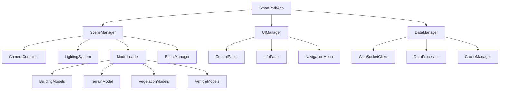
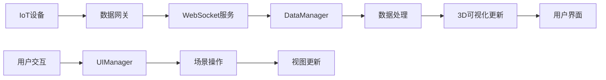
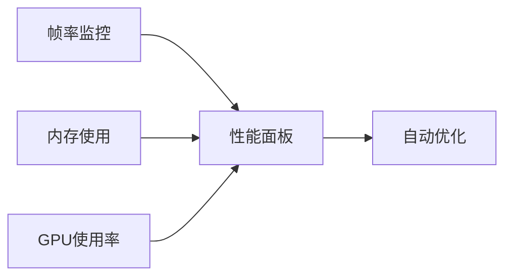

# 智慧园区3D可视化显示系统设计文档

## 概述

本系统是一个基于Three.js的智慧园区3D可视化显示平台，旨在为园区管理者提供直观的3D园区视图和实时数据展示功能。系统将园区的物理空间、设备状态、人员流动等信息以三维可视化的方式呈现，支持交互式浏览和实时监控。

### 核心价值
- **空间感知增强**：通过3D视图提供比2D地图更直观的空间理解
- **实时监控**：集成各类IoT设备数据，实现园区状态实时可视化
- **交互式操作**：支持鼠标/触控操作，可自由浏览园区各个角度
- **数据集成**：统一展示来自不同系统的园区数据

## 技术栈与依赖

### 核心技术
- **Three.js**: 3D渲染引擎
- **WebGL**: 硬件加速的3D图形渲染
- **JavaScript/TypeScript**: 主要开发语言
- **HTML5/CSS3**: 界面布局和样式

### 辅助技术
- **Webpack/Vite**: 构建工具
- **WebSocket**: 实时数据通信
- **dat.GUI**: 调试控制面板
- **Stats.js**: 性能监控

## 组件架构

### 核心组件层次结构



### 组件定义

#### 1. SceneManager (场景管理器)
**职责**: 管理Three.js场景的创建、更新和渲染
- 初始化3D场景、相机、渲染器
- 管理场景中的所有3D对象
- 处理渲染循环和性能优化

**接口设计**:
```typescript
interface SceneManager {
  scene: THREE.Scene
  camera: THREE.Camera
  renderer: THREE.WebGLRenderer
  
  init(): void
  addObject(object: THREE.Object3D): void
  removeObject(object: THREE.Object3D): void
  render(): void
  dispose(): void
}
```

#### 2. CameraController (相机控制器)
**职责**: 处理相机的移动、旋转、缩放等交互操作
- 支持轨道控制（OrbitControls）
- 相机平滑动画过渡
- 预设视角切换

#### 3. ModelLoader (模型加载器)
**职责**: 加载和管理3D模型资源
- 支持GLTF/GLB格式模型加载
- 模型缓存和复用机制
- LOD（细节层次）优化

#### 4. DataManager (数据管理器)
**职责**: 处理实时数据的获取、处理和分发
- WebSocket连接管理
- 数据格式标准化
- 数据缓存和本地存储

#### 5. UIManager (界面管理器)
**职责**: 管理2D UI界面和3D场景的交互
- 控制面板状态管理
- 信息面板动态更新
- 响应式布局适配

## 数据流架构

### 数据流向图



### 数据模型

#### 园区基础数据结构
```typescript
interface ParkData {
  buildings: BuildingInfo[]
  facilities: FacilityInfo[]
  sensors: SensorData[]
  vehicles: VehicleInfo[]
  personnel: PersonnelInfo[]
}

interface BuildingInfo {
  id: string
  name: string
  position: Vector3
  model: string
  floors: FloorInfo[]
  occupancy: number
  energy: EnergyData
}

interface SensorData {
  id: string
  type: 'temperature' | 'humidity' | 'air_quality' | 'motion'
  position: Vector3
  value: number
  status: 'online' | 'offline' | 'warning'
  timestamp: Date
}
```

## 渲染与性能策略

### 渲染优化
1. **分层渲染**: 静态场景和动态元素分层管理
2. **LOD系统**: 根据距离动态调整模型细节
3. **批处理**: 相同材质对象合并渲染
4. **视锥剔除**: 只渲染可见区域内的对象

### 性能监控


## 交互设计

### 相机控制
- **轨道旋转**: 鼠标左键拖拽
- **平移**: 鼠标右键拖拽或中键拖拽
- **缩放**: 鼠标滚轮
- **预设视角**: 点击导航按钮快速切换

### 对象交互
- **悬停高亮**: 鼠标悬停时对象高亮显示
- **点击选择**: 点击对象显示详细信息
- **双击聚焦**: 双击对象自动调整相机视角

### 数据可视化交互
- **实时更新**: 传感器数据实时更新颜色和动画
- **时间轴控制**: 支持历史数据回放
- **筛选器**: 按类型、状态筛选显示对象

## 状态管理

### 应用状态结构
```typescript
interface AppState {
  scene: {
    loadingProgress: number
    selectedObject: string | null
    cameraPosition: Vector3
    renderSettings: RenderSettings
  }
  data: {
    realTimeData: SensorData[]
    buildingStatus: BuildingStatus[]
    alerts: AlertInfo[]
  }
  ui: {
    panelVisible: boolean
    currentView: ViewMode
    filterSettings: FilterSettings
  }
}
```

## 安全考虑

### 数据安全
- WebSocket连接使用WSS加密
- 敏感数据客户端不存储
- API访问token验证

### 性能安全
- 内存泄漏防护
- 渲染帧率限制
- 资源加载超时处理

## 测试策略

### 单元测试
- 核心组件功能测试
- 数据处理逻辑测试
- 工具函数测试

测试框架: Jest + Testing Library

### 性能测试
- 渲染性能基准测试
- 内存使用监控
- 大数据量压力测试

### 兼容性测试
- 主流浏览器兼容性
- 不同设备性能表现
- WebGL支持检测